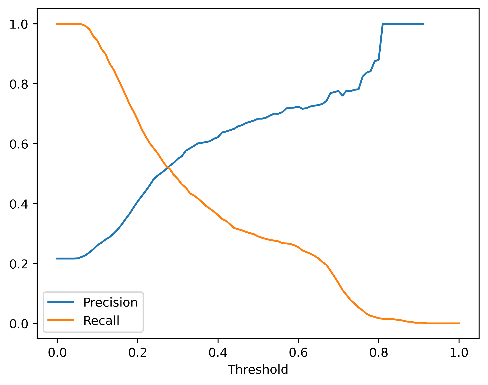
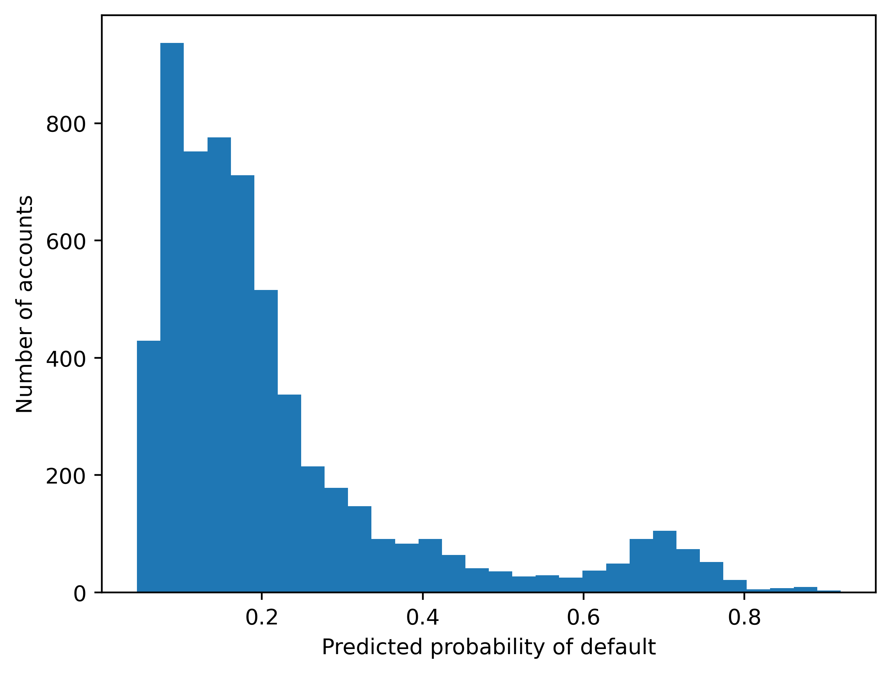

# Projeto 6 — Imputação de Valores Ausentes (PAY_1)

Comparação de estratégias de imputação para o valor ausente de `PAY_1` (pagamento do mês anterior), com validação cruzada e varredura de threshold de classificação.

**Fonte do projeto:** livro *Projetos de Ciência de Dados com Python* — Stephen Klosterman (Novatec Editora, 2020), Lição 6.

## Metodologia

1. **Dados:** UCI Credit Card (5.333 registros, 23 variáveis); `PAY_1` é removido do modelo e imputado em tempo de predição.
2. **Estratégias de imputação comparadas:**
   - **Média** do valor observado;
   - **Aleatória** (valor uniformemente sorteado);
   - **Random Forest** (imputação aprendida).
3. **Avaliação:**
   - AUC médio em validação cruzada para cada estratégia;
   - Varredura de **threshold** de probabilidade para a decisão final;
   - Curvas precisão × recall e custo/benefício da triagem.

## Resultados

| Estratégia | AUC médio |
|---|---|
| Imputação pela **média** | **0.7729** |
| Imputação aleatória | 0.7693 |
| Imputação por random forest | (inferior) |

- **Imputar pela média vence** — simples e eficaz para esta variável.
- A varredura de threshold permite escolher o ponto de corte que equilibra precisão e recall conforme o custo do erro.





## Estrutura do repositório

| Caminho | Conteúdo |
|---|---|
| `imputacao_pagamentos.ipynb` | Notebook completo, já executado |
| `Data/` | Datasets do projeto (UCI Credit Card) |
| `img/` | Figuras extraídas do notebook |

## Como executar

```bash
pip install pandas numpy matplotlib seaborn scikit-learn xlrd
jupyter notebook imputacao_pagamentos.ipynb
```

## Dependências

`pandas 1.5.3`, `numpy 1.24.4`, `scikit-learn 1.3.2`, `matplotlib 3.7.5`, `seaborn 0.13.2`
